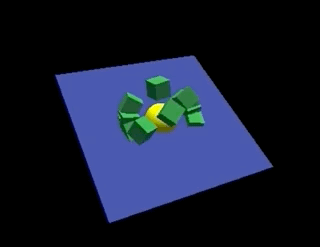

# ThreeJS Typescript 

Example project for [ThreeJS](https://threejs.org) with [Typescript](https://www.typescriptlang.org) and [Parcel](https://parceljs.org)



<br>
<br>
<br>

## Installing

We need parcel to bundle modules. You can install it globally.

```bash
npm install -g parcel-bundler
```

Parcel will bundle Three.js with our own modules, and convert Typescript to Javascript.

```
npm install three
npm install @types/three
npm install typescript
```
Create a `dev` folder with your HTML and Typescript files. Create an empty `dist` folder.

<br>
<br>
<br>

## Running

```bash
# Watch mode
npm run dev

# build
npm run build
```

<br>
<br>
<br>

## HTML

Remember that parcel compiles *all* files and will convert typescript to javascript. That means your `html` file can load a `.ts` file!

```html
<script defer src="./ts/game.ts"></script>
```
<br>
<Br>
<br>

## Typescript

```typescript
import * as THREE from 'three'
import { OrbitControls } from 'three/examples/jsm/controls/OrbitControls.js'

class Game {

    private scene: THREE.Scene
    private camera: THREE.Camera
    private renderer: THREE.Renderer

    constructor() {
        this.scene = new THREE.Scene()
        this.camera = new THREE.PerspectiveCamera(75, window.innerWidth / window.innerHeight, 0.1, 1000)
        this.camera.position.z = 40

        this.renderer = new THREE.WebGLRenderer()
        this.renderer.setSize(window.innerWidth, window.innerHeight)
        document.body.appendChild(this.renderer.domElement)

        const light = new THREE.AmbientLight(0x404040)
        this.scene.add(light)

        this.gameLoop()
    }

    gameLoop() {
        this.renderer.render(this.scene, this.camera)
        requestAnimationFrame(() => this.gameLoop())
    }
}
new Game()
```

<br>
<br>
<br>

## Links

- [ThreeJS](https://threejs.org) 
- [Typescript](https://www.typescriptlang.org) 
- [Parcel](https://parceljs.org)

<br>
<br>
<br>

## Bugs

ParcelJS has a CSS bug!! Temporary fix with --no-minify. Todo: downgrade parcel to 1.8.1.